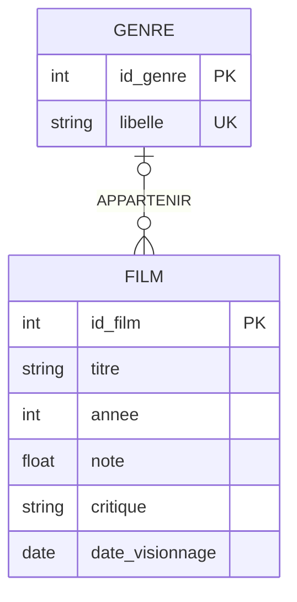

# 📐 Conception de la base de données — Cinémastre

Conception réalisée selon la méthode **Merise** : MCD → MLD → MPD.

---

## 1. Dictionnaire des données

| Code              | Désignation                          | Type      | Contraintes |
|-------------------|--------------------------------------|-----------|-------------|
| `id_film`         | Identifiant du film                  | Entier    | Clé, auto-incrément |
| `titre`           | Titre du film                        | Texte 255 | Obligatoire |
| `annee`           | Année de sortie                      | Entier    | Facultatif, entre 1888 et 2100 |
| `note`            | Note personnelle                     | Réel      | Obligatoire, entre 0,5 et 5 (pas de 0,5) |
| `critique`        | Avis personnel                       | Texte     | Facultatif |
| `date_visionnage` | Date à laquelle le film a été vu     | Date      | Obligatoire, pas dans le futur |
| `id_genre`        | Identifiant du genre                 | Entier    | Clé, auto-incrément |
| `libelle`         | Nom du genre (Sci-Fi, Comédie…)      | Texte 100 | Obligatoire, unique |

**Règles de gestion :**
- RG1 : un film appartient à **au plus un** genre (le genre peut être inconnu).
- RG2 : un genre peut regrouper **zéro ou plusieurs** films.
- RG3 : la note est attribuée par l'utilisateur entre 0,5 et 5, par demi-points.
- RG4 : un film ne peut pas être marqué comme vu à une date future.

---

## 2. MCD — Modèle Conceptuel de Données

Deux entités reliées par une association `APPARTENIR` :

```
┌──────────────────────────┐                        ┌─────────────────────┐
│          FILM            │                        │        GENRE        │
├──────────────────────────┤   (0,1)        (0,n)   ├─────────────────────┤
│ id_film                  │────────APPARTENIR──────│ id_genre            │
│ titre                    │                        │ libelle             │
│ annee                    │                        └─────────────────────┘
│ note                     │
│ critique                 │
│ date_visionnage          │
└──────────────────────────┘
```

Lecture des cardinalités :
- Un **FILM** appartient à **0 ou 1** GENRE *(0,1)* — le genre est facultatif (RG1).
- Un **GENRE** regroupe **0 à n** FILMs *(0,n)* (RG2).

Version diagramme (rendu automatiquement par GitHub) :



---

## 3. MLD — Modèle Logique de Données

Passage MCD → MLD : l'association `APPARTENIR` est de type **1:N** (cardinalité maximale 1 côté FILM, n côté GENRE). La règle de transformation s'applique : **la clé primaire du côté (0,n) migre comme clé étrangère** dans la relation du côté (0,1). Comme la cardinalité minimale est 0, la clé étrangère est **nullable**.

```
GENRE (id_genre, libelle)
       clé primaire : id_genre
       contrainte   : libelle unique

FILM (id_film, titre, annee, note, critique, date_visionnage, #id_genre)
       clé primaire  : id_film
       clé étrangère : id_genre → GENRE(id_genre), NULL autorisé
```

*(notation : souligné = clé primaire, # = clé étrangère)*

---

## 4. MPD — Modèle Physique de Données

Implémentation **SQLite** (SGBD du projet). Les règles de gestion sont traduites en contraintes `CHECK` :

```sql
CREATE TABLE genre (
    id_genre  INTEGER PRIMARY KEY AUTOINCREMENT,
    libelle   VARCHAR(100) NOT NULL UNIQUE
);

CREATE TABLE film (
    id_film          INTEGER PRIMARY KEY AUTOINCREMENT,
    titre            VARCHAR(255) NOT NULL,
    annee            INTEGER      NULL
                     CHECK (annee IS NULL OR annee BETWEEN 1888 AND 2100),
    note             REAL         NOT NULL
                     CHECK (note BETWEEN 0.5 AND 5.0),
    critique         TEXT         NULL,
    date_visionnage  DATE         NOT NULL,
    id_genre         INTEGER      NULL
                     REFERENCES genre(id_genre)
);
```

> Dans l'application, ces tables sont créées automatiquement au démarrage par l'ORM **Exposed** (`src/main/kotlin/fr/cinemastre/Db.kt`), dont les définitions correspondent à ce MPD. La validation applicative (note bornée, date non future, titre obligatoire) est faite dans `Models.kt` afin de renvoyer des messages d'erreur clairs à l'utilisateur (HTTP 422).

---

## 5. Justification des choix

- **Genre en table séparée** plutôt qu'un champ texte libre : évite la redondance et les fautes de frappe (« Sci-Fi » / « SciFi » / « sci fi »), permet des statistiques fiables par genre, et illustre une association 1:N propre.
- **Clé étrangère nullable** : un utilisateur peut enregistrer un film sans connaître/préciser son genre — l'application le classe alors dans « Inconnu » à l'affichage.
- **SQLite** : aucune installation de SGBD, la base vit dans un simple fichier (`data/cinemastre.db`), parfaitement adapté à un projet mono-utilisateur conteneurisé. Un volume Docker rend la base persistante entre deux redémarrages.
